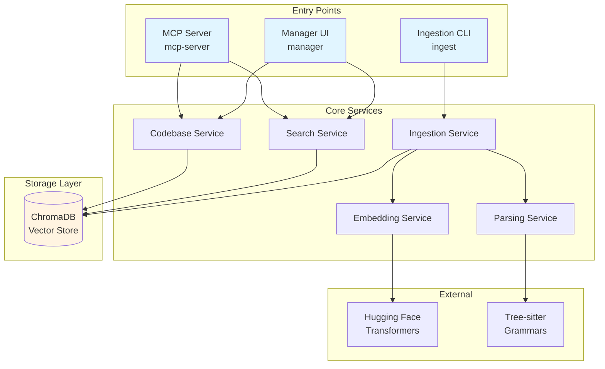

# Design Document: Codebase Memory MCP Server

## Overview

The Codebase Memory MCP Server is a local-first semantic search system built as a single TypeScript package with three distinct entry points: an MCP server for LLM assistant integration, an ingestion CLI for indexing codebases, and a Fastify-based web server for management. The system uses Tree-sitter for AST-aware code chunking, local Hugging Face transformers for embedding generation, and ChromaDB for vector storage.

### Key Design Principles

1. **Local-First**: All operations run locally without external API calls
2. **Re-ingestion Model**: No incremental updates or file watching; full re-ingestion on changes
3. **Explicit Language Support**: Clear detection and reporting of unsupported languages
4. **MCP Protocol Compliance**: Strict adherence to MCP specification for tool definitions and responses
5. **Single Package, Multiple Entry Points**: One npm package with three executable commands

### Technology Stack

- **Runtime**: Node.js 23+ with native TypeScript support
- **Vector Database**: ChromaDB with local persistence
- **Code Parsing**: Tree-sitter with language-specific grammars
- **Embeddings**: `@huggingface/transformers` (local model execution)
- **Web Server**: Fastify with single-page UI
- **MCP Transport**: stdio-based communication
- **Logging**: Pino for structured logging

## Architecture

### System Components



### Component Responsibilities

**MCP Server (`mcp-server`)**
- Exposes MCP tools: `list_knowledgebases`, `search_knowledgebases`, `get_knowledgebase_stats`, `open_knowledgebase_manager`
- Validates tool inputs against schemas
- Delegates to Codebase Service and Search Service
- Returns MCP-compliant responses

**Ingestion CLI (`ingest`)**
- Accepts directory path and codebase name as arguments
- Orchestrates file scanning, parsing, embedding, and storage
- Reports progress and statistics
- Handles unsupported language detection

**Manager UI (`manager`)**
- Starts Fastify server on configurable port
- Serves single-page web application
- Provides HTTP API endpoints for codebase management
- Opens default browser to UI

**Codebase Service**
- CRUD operations for codebases
- Retrieves codebase statistics
- Manages ChromaDB collections
- Handles codebase renaming and deletion

**Search Service**
- Executes semantic search queries
- Applies metadata filters (codebase, language, file path)
- Ranks results by similarity score
- Formats results with context

**Ingestion Service**
- Coordinates file scanning and processing
- Batches operations for memory efficiency
- Tracks ingestion progress
- Generates ingestion statistics

**Embedding Service**
- Loads and caches Hugging Face transformer model
- Generates embeddings for code chunks
- Handles model initialization and errors

**Parsing Service**
- Detects file language from extension
- Loads appropriate Tree-sitter grammar
- Extracts semantic chunks (functions, classes, methods)
- Captures chunk metadata (line ranges, type, context)

## Components and Interfaces

### MCP Server Tools

#### Tool: `list_knowledgebases`

**Input Schema:**
```typescript
{
  // No parameters
}
```

**Output Schema:**
```typescript
{
  codebases: Array<{
    name: string;
    path: string;
    chunkCount: number;
    fileCount: number;
    lastIngestion: string; // ISO 8601 timestamp
    languages: string[];
  }>;
}
```

#### Tool: `search_knowledgebases`

**Input Schema:**
```typescript
{
  query: string;
  codebaseName?: string; // Optional filter
  language?: string; // Optional filter
  maxResults?: number; // Default: 50
}
```

**Output Schema:**
```typescript
{
  results: Array<{
    filePath: string;
    startLine: number;
    endLine: number;
    language: string;
    chunkType: string; // "function" | "class" | "method" | "interface" | "property"
    content: string;
    similarityScore: number;
    codebaseName: string;
  }>;
  totalResults: number;
  queryTime: number; // milliseconds
}
```

#### Tool: `get_knowledgebase_stats`

**Input Schema:**
```typescript
{
  name: string;
}
```

**Output Schema:**
```typescript
{
  name: string;
  path: string;
  chunkCount: number;
  fileCount: number;
  lastIngestion: string;
  languages: Array<{
    language: string;
    fileCount: number;
    chunkCount: number;
  }>;
  chunkTypes: Array<{
    type: string;
    count: number;
  }>;
  sizeBytes: number;
}
```

#### Tool: `open_knowledgebase_manager`

**Input Schema:**
```typescript
{
  // No parameters
}
```

**Output Schema:**
```typescript
{
  url: string; // e.g., "http://localhost:8008"
  message: string;
}
```

### Ingestion CLI Interface

**Command:**
```bash
ingest --path <directory> --name <codebase-name> [--config <config-file>]
```

**Arguments:**
- `--path`: Absolute or relative path to codebase directory (required)
- `--name`: Unique name for the codebase (required)
- `--config`: Path to configuration file (optional)

**Output:**
```
Ingesting codebase: my-project
Scanning directory: /path/to/project
Found 1,234 files

Processing files...
[████████████████████] 100% (1,234/1,234)

Supported files: 1,100
Unsupported files: 134
  - .md: 50 files
  - .json: 40 files
  - .xml: 44 files

Chunks created: 5,678
Languages detected:
  - TypeScript: 3,200 chunks (800 files)
  - Python: 1,500 chunks (200 files)
  - Java: 978 chunks (100 files)

Generating embeddings...
[████████████████████] 100% (5,678/5,678)

Storing in ChromaDB...
Done!

Ingestion completed in 45.2s
```

### HTTP API Endpoints

**GET `/api/knowledgebases`**
- Returns list of all knowledge bases
- Response: `{ codebases: Codebase[] }`

**POST `/api/search`**
- Body: `{ query: string, codebaseName?: string, language?: string, maxResults?: number }`
- Response: `{ results: SearchResult[], totalResults: number, queryTime: number }`

**GET `/api/knowledgebases/:name/stats`**
- Returns detailed statistics for a codebase
- Response: `CodebaseStats`

**PUT `/api/knowledgebases/:name`**
- Body: `{ newName: string }`
- Response: `{ success: boolean, message: string }`

**DELETE `/api/knowledgebases/:name`**
- Deletes a codebase and all its chunks
- Response: `{ success: boolean, message: string }`

**DELETE `/api/knowledgebases/:name/chunk-sets/:timestamp`**
- Deletes chunks from a specific ingestion
- Response: `{ success: boolean, chunksDeleted: number }`

### Service Interfaces

#### CodebaseService

```typescript
interface CodebaseService {
  listCodebases(): Promise<CodebaseMetadata[]>;
  getCodebaseStats(name: string): Promise<CodebaseStats>;
  renameCodebase(oldName: string, newName: string): Promise<void>;
  deleteCodebase(name: string): Promise<void>;
  deleteChunkSet(codebaseName: string, timestamp: string): Promise<number>;
}
```

#### SearchService

```typescript
interface SearchService {
  search(params: SearchParams): Promise<SearchResults>;
}

interface SearchParams {
  query: string;
  codebaseName?: string;
  language?: string;
  maxResults?: number;
}

interface SearchResults {
  results: SearchResult[];
  totalResults: number;
  queryTime: number;
}
```

#### IngestionService

```typescript
interface IngestionService {
  ingestCodebase(params: IngestionParams): Promise<IngestionStats>;
}

interface IngestionParams {
  path: string;
  name: string;
  config: Config;
}

interface IngestionStats {
  totalFiles: number;
  supportedFiles: number;
  unsupportedFiles: Map<string, number>;
  chunksCreated: number;
  languages: Map<string, LanguageStats>;
  durationMs: number;
}
```

#### EmbeddingService

```typescript
interface EmbeddingService {
  initialize(): Promise<void>;
  generateEmbedding(text: string): Promise<number[]>;
  batchGenerateEmbeddings(texts: string[]): Promise<number[][]>;
}
```

#### ParsingService

```typescript
interface ParsingService {
  detectLanguage(filePath: string): Language | null;
  parseFile(filePath: string, language: Language): Promise<Chunk[]>;
}

interface Chunk {
  content: string;
  startLine: number;
  endLine: number;
  chunkType: ChunkType;
  language: Language;
  filePath: string;
}

type ChunkType = "function" | "class" | "method" | "interface" | "property" | "field";
type Language = "csharp" | "java" | "javascript" | "typescript" | "python";
```

## Data Models

### ChromaDB Schema

**Collection Naming:**
- Pattern: `codebase_{name}_{schemaVersion}`
- Example: `codebase_my-project_v1`

**Document Structure:**
```typescript
{
  id: string; // UUID
  embedding: number[]; // Vector from embedding model
  metadata: {
    codebaseName: string;
    filePath: string;
    startLine: number;
    endLine: number;
    language: string;
    chunkType: string;
    ingestionTimestamp: string; // ISO 8601
    schemaVersion: string; // e.g., "1.0.0"
  };
  document: string; // The actual code content
}
```

**Indexes:**
- Vector index on `embedding` (automatic in ChromaDB)
- Metadata filters on: `codebaseName`, `language`, `filePath`, `ingestionTimestamp`

### Configuration Schema

```typescript
interface Config {
  chromadb: {
    persistPath: string; // Default: ~/.knowledge-base/chromadb
  };
  embedding: {
    modelName: string; // Default: "Xenova/all-MiniLM-L6-v2"
    cachePath: string; // Default: ~/.knowledge-base/models
  };
  server: {
    port: number; // Default: 8008
    host: string; // Default: "localhost"
  };
  mcp: {
    transport: "stdio"; // Only stdio supported
  };
  ingestion: {
    batchSize: number; // Default: 100 chunks per batch
    maxFileSize: number; // Default: 1MB (skip larger files)
  };
  search: {
    defaultMaxResults: number; // Default: 50
    cacheTimeoutSeconds: number; // Default: 60
  };
  logging: {
    level: "debug" | "info" | "warn" | "error"; // Default: "info"
  };
  schemaVersion: string; // Current: "1.0.0"
}
```

### Language Support Mapping

```typescript
const LANGUAGE_SUPPORT: Record<string, Language> = {
  ".cs": "csharp",
  ".java": "java",
  ".js": "javascript",
  ".jsx": "javascript",
  ".ts": "typescript",
  ".tsx": "typescript",
  ".py": "python"
};

const TREE_SITTER_GRAMMARS: Record<Language, string> = {
  "csharp": "tree-sitter-c-sharp",
  "java": "tree-sitter-java",
  "javascript": "tree-sitter-javascript",
  "typescript": "tree-sitter-typescript",
  "python": "tree-sitter-python"
};
```

### Chunk Type Extraction Rules

**C#:**
- Classes: `class_declaration`
- Methods: `method_declaration`
- Properties: `property_declaration`
- Interfaces: `interface_declaration`

**Java (JDK22+):**
- Classes: `class_declaration`
- Methods: `method_declaration`
- Fields: `field_declaration`
- Interfaces: `interface_declaration`

**JavaScript/TypeScript:**
- Functions: `function_declaration`, `arrow_function`
- Classes: `class_declaration`
- Methods: `method_definition`
- Exports: `export_statement` with function/class

**Python:**
- Functions: `function_definition`
- Classes: `class_definition`
- Methods: `function_definition` within `class_definition`

## Correctness Properties

*A property is a characteristic or behavior that should hold true across all valid executions of a system—essentially, a formal statement about what the system should do. Properties serve as the bridge between human-readable specifications and machine-verifiable correctness guarantees.*


### Property Reflection

After analyzing all acceptance criteria, several redundancies were identified:

**Redundancies Eliminated:**
1. Requirements 1.1, 1.3, and 8.1, 8.3 all test similar "list/get" operations - consolidated into comprehensive retrieval properties
2. Requirements 2.5 and 5.3 both test metadata storage - combined into single storage round-trip property
3. Requirements 7.4, 7.5, 7.6 and 8.4, 8.5 test same operations (UI vs API) - test at API level only
4. Requirements 14.1 and 14.5 are identical - test once
5. Requirements 3.1-3.4 all test parsing for different languages - can be combined into language-agnostic parsing property
6. Requirements 6.1, 6.2, 6.3 all test language detection - consolidated into single detection property

**Properties Retained:**
- Each unique functional behavior gets one property
- Edge cases are handled by property generators
- Integration tests (examples) are kept separate from properties

### Properties

**Property 1: Codebase Retrieval Completeness**

*For any* set of indexed knowledge bases, calling `list_knowledgebases` should return all knowledge bases with complete metadata (name, path, chunk count, file count, last ingestion timestamp, languages).

**Validates: Requirements 1.1, 8.1**

---

**Property 2: Search Result Relevance and Ranking**

*For any* search query and optional filters (codebase name, language), all returned results should match the filter criteria and be ranked in descending order by similarity score.

**Validates: Requirements 1.2, 8.2**

---

**Property 3: Search Result Metadata Completeness**

*For any* search result, the result should include all required fields: file path, start line, end line, language, chunk type, content, similarity score, and codebase name.

**Validates: Requirements 1.5**

---

**Property 4: Statistics Accuracy**

*For any* codebase, the statistics returned by `get_knowledgebase_stats` should accurately reflect the actual counts of chunks, files, languages, and chunk types stored in ChromaDB.

**Validates: Requirements 1.3, 8.3**

---

**Property 5: Recursive File Discovery**

*For any* directory structure, ingestion should discover all files recursively, including files in nested subdirectories.

**Validates: Requirements 2.1**

---

**Property 6: Supported Language Parsing**

*For any* file with a supported language extension (.cs, .java, .js, .jsx, .ts, .tsx, .py), the system should parse it using Tree-sitter and extract at least one semantic chunk.

**Validates: Requirements 2.2, 3.1, 3.2, 3.3, 3.4**

---

**Property 7: Unsupported Language Handling**

*For any* file with an unsupported extension, the system should skip it and log a warning containing the file path.

**Validates: Requirements 2.3, 6.2**

---

**Property 8: Embedding Generation**

*For any* extracted code chunk, the system should generate an embedding vector with consistent dimensionality matching the embedding model's output size.

**Validates: Requirements 2.4, 4.2**

---

**Property 9: Storage Round-Trip Preservation**

*For any* code chunk with metadata (file path, line range, language, chunk type, codebase name), storing it in ChromaDB and then retrieving it should preserve all metadata fields exactly.

**Validates: Requirements 2.5, 5.3**

---

**Property 10: Ingestion Statistics Accuracy**

*For any* codebase ingestion, the reported statistics (total files, supported files, unsupported files, chunks created, language distribution) should match the actual counts from processing.

**Validates: Requirements 2.6, 6.3**

---

**Property 11: Context Preservation in Chunks**

*For any* code chunk that has associated comments or docstrings, the extracted chunk content should include those comments/docstrings within the chunk boundaries.

**Validates: Requirements 3.5**

---

**Property 12: Nested Structure Chunking**

*For any* file containing nested structures (e.g., methods within classes), the system should create separate chunks for each semantic unit (both the class and each method).

**Validates: Requirements 3.6**

---

**Property 13: Embedding Model Consistency**

*For any* two ingestion operations, the embedding model name and version used should be identical to ensure vector compatibility.

**Validates: Requirements 4.5**

---

**Property 14: Embedding Error Recovery**

*For any* chunk where embedding generation fails, the system should log the error and continue processing remaining chunks without terminating.

**Validates: Requirements 4.3, 11.2**

---

**Property 15: Collection Management**

*For any* codebase, storing chunks should create or update a ChromaDB collection with a name following the pattern `codebase_{name}_{schemaVersion}`.

**Validates: Requirements 5.2**

---

**Property 16: Search Filter Application**

*For any* search query with metadata filters (codebase name, language, file path), all returned results should satisfy all specified filter conditions.

**Validates: Requirements 5.4**

---

**Property 17: Codebase Deletion Completeness**

*For any* codebase, deleting it should remove its ChromaDB collection and all associated chunks, such that subsequent searches return zero results for that codebase.

**Validates: Requirements 5.5, 7.5, 8.5**

---

**Property 18: Language Detection Accuracy**

*For any* file with a known extension (.cs, .java, .js, .jsx, .ts, .tsx, .py), the detected language should match the extension mapping defined in the language support configuration.

**Validates: Requirements 6.1**

---

**Property 19: Codebase Rename Propagation**

*For any* codebase, renaming it should update the codebase name in all associated chunk metadata, such that searches by the new name return all chunks and searches by the old name return zero results.

**Validates: Requirements 7.4, 8.4**

---

**Property 20: API Error Response Format**

*For any* API endpoint error (invalid input, not found, server error), the response should include an appropriate HTTP status code (4xx or 5xx) and a JSON error message with details.

**Validates: Requirements 8.6, 11.4**

---

**Property 21: Configuration Loading**

*For any* valid configuration file or environment variables, the system should load all configuration values and make them accessible to all components.

**Validates: Requirements 10.1**

---

**Property 22: Configuration Defaults**

*For any* missing optional configuration value, the system should use the documented default value (e.g., port 8008, max results 50, cache timeout 60s).

**Validates: Requirements 10.3**

---

**Property 23: Configuration Validation**

*For any* invalid configuration value (e.g., negative port, invalid path), the system should log an error message and exit with a non-zero status code before starting any services.

**Validates: Requirements 10.4, 10.5**

---

**Property 24: Error Logging Completeness**

*For any* error encountered during operation, the logged error should include the component name, operation being performed, error message, and stack trace.

**Validates: Requirements 11.1**

---

**Property 25: MCP Input Validation**

*For any* MCP tool call with invalid parameters (missing required fields, wrong types), the MCP server should return a structured error response in MCP-compliant format without executing the tool.

**Validates: Requirements 11.3, 15.2**

---

**Property 26: Structured Logging Levels**

*For any* log level configuration (debug, info, warn, error), only messages at or above the configured level should be output to the log.

**Validates: Requirements 11.5**

---

**Property 27: Embedding Model Caching**

*For any* process lifetime, the embedding model should be loaded exactly once and reused for all subsequent embedding generation operations.

**Validates: Requirements 12.1**

---

**Property 28: Search Result Caching**

*For any* two identical search queries (same query string and filters) made within 60 seconds, the second query should return cached results without querying ChromaDB.

**Validates: Requirements 12.3**

---

**Property 29: Batch Processing**

*For any* ingestion operation, files should be processed in batches of the configured batch size (default 100), not all at once.

**Validates: Requirements 12.4**

---

**Property 30: Search Result Limiting**

*For any* search query, the number of returned results should not exceed the configured maximum (default 50), even if more matching chunks exist.

**Validates: Requirements 12.5**

---

**Property 31: Schema Version Metadata**

*For any* ChromaDB collection created by the system, the collection metadata should include a schema version field matching the current system schema version constant.

**Validates: Requirements 13.1**

---

**Property 32: Schema Version Validation**

*For any* existing ChromaDB collection, when the system starts, it should check the schema version and log a warning if the version does not match the current system version.

**Validates: Requirements 13.2, 13.3**

---

**Property 33: Re-ingestion Cleanup**

*For any* codebase that is re-ingested, all chunks from previous ingestions should be deleted before new chunks are stored, ensuring no duplicate or stale chunks remain.

**Validates: Requirements 14.1**

---

**Property 34: Ingestion Timestamp Uniqueness**

*For any* two sequential ingestion operations on the same codebase, the ingestion timestamps should be different, allowing distinction between chunk sets.

**Validates: Requirements 14.2**

---

**Property 35: Re-ingestion Diff Reporting**

*For any* re-ingestion operation, the system should report the difference in chunk count (increase or decrease) compared to the previous ingestion.

**Validates: Requirements 14.3**

---

**Property 36: MCP Response Format Compliance**

*For any* successful MCP tool call, the response should conform to the MCP specification format with the correct structure for the tool's output schema.

**Validates: Requirements 15.3**

---

**Property 37: MCP Error Format Compliance**

*For any* failed MCP tool call, the error response should conform to the MCP specification error format with an error code and message.

**Validates: Requirements 15.4**

---

## Error Handling

### Error Categories

**Parsing Errors:**
- Tree-sitter parse failures (malformed code)
- Unsupported language detection
- File read errors (permissions, encoding)

**Strategy:** Log error with file path and continue processing remaining files. Include parse error count in ingestion statistics.

**Embedding Errors:**
- Model loading failures
- Embedding generation failures
- Out of memory errors

**Strategy:** For model loading failures, exit with error. For individual embedding failures, log error and skip chunk. For OOM errors, reduce batch size and retry.

**Storage Errors:**
- ChromaDB connection failures
- Collection creation failures
- Document insertion failures

**Strategy:** For connection failures, exit with error. For insertion failures, log error and continue with remaining chunks. Report failed insertions in statistics.

**MCP Protocol Errors:**
- Invalid tool names
- Schema validation failures
- Malformed requests

**Strategy:** Return MCP-compliant error responses with specific error codes. Never crash the server on invalid input.

**API Errors:**
- Invalid request parameters
- Resource not found
- Server errors

**Strategy:** Return appropriate HTTP status codes (400, 404, 500) with JSON error details. Log all 500 errors with stack traces.

**Configuration Errors:**
- Missing required config values
- Invalid config values
- File system permission errors

**Strategy:** Validate all config at startup. Exit with clear error message if validation fails. Never start with invalid configuration.

### Error Response Formats

**MCP Error Response:**
```typescript
{
  error: {
    code: string; // e.g., "INVALID_PARAMETERS", "TOOL_NOT_FOUND"
    message: string;
    data?: any; // Optional additional context
  }
}
```

**HTTP API Error Response:**
```typescript
{
  error: {
    code: string; // e.g., "VALIDATION_ERROR", "NOT_FOUND"
    message: string;
    details?: any; // Optional validation errors or stack trace
  }
}
```

**CLI Error Output:**
```
Error: [Component] Operation failed
Details: Specific error message
File: /path/to/file (if applicable)
Stack trace: ... (in debug mode)
```

### Logging Strategy

**Log Levels:**
- **DEBUG**: Detailed execution flow, variable values, performance metrics
- **INFO**: Normal operations (ingestion started, search completed, server started)
- **WARN**: Recoverable errors (unsupported files, parse failures, cache misses)
- **ERROR**: Unrecoverable errors (model loading failed, ChromaDB connection failed)

**Structured Log Format:**
```typescript
{
  timestamp: string; // ISO 8601
  level: "debug" | "info" | "warn" | "error";
  component: string; // e.g., "IngestionService", "MCPServer"
  operation: string; // e.g., "parseFile", "search"
  message: string;
  context?: {
    codebaseName?: string;
    filePath?: string;
    chunkCount?: number;
    durationMs?: number;
    // ... other contextual data
  };
  error?: {
    message: string;
    stack: string;
    code?: string;
  };
}
```

## Testing Strategy

### Dual Testing Approach

The system requires both unit tests and property-based tests for comprehensive coverage:

**Unit Tests:**
- Specific examples demonstrating correct behavior
- Edge cases (empty files, files with only comments, deeply nested structures)
- Error conditions (invalid inputs, missing files, malformed code)
- Integration points between components
- MCP protocol compliance examples
- HTTP API endpoint examples

**Property-Based Tests:**
- Universal properties that hold for all inputs
- Comprehensive input coverage through randomization
- Minimum 100 iterations per property test
- Each property test references its design document property

### Property-Based Testing Configuration

**Library:** Use `fast-check` for TypeScript property-based testing

**Configuration:**
```typescript
import fc from 'fast-check';

// Example property test configuration
fc.assert(
  fc.property(
    fc.array(fc.string()), // Generator for test inputs
    (input) => {
      // Property assertion
      const result = functionUnderTest(input);
      return result.satisfiesProperty();
    }
  ),
  { numRuns: 100 } // Minimum 100 iterations
);
```

**Tagging Convention:**
```typescript
// Feature: codebase-memory-mcp, Property 9: Storage Round-Trip Preservation
test('property: storage preserves all metadata', () => {
  fc.assert(
    fc.property(chunkGenerator, (chunk) => {
      const stored = store(chunk);
      const retrieved = retrieve(stored.id);
      return deepEqual(chunk.metadata, retrieved.metadata);
    }),
    { numRuns: 100 }
  );
});
```

### Test Coverage Requirements

- **Minimum 80% statement coverage** across all components
- **Minimum 80% branch coverage** for conditional logic
- **90%+ coverage** for critical paths (ingestion pipeline, search, MCP tools)
- **All public APIs** must have both unit tests and property tests where applicable

### Test Organization

```
src/
├── domains/
│   ├── ingestion/
│   │   ├── __tests__/
│   │   │   ├── ingestion.service.test.ts (unit tests)
│   │   │   └── ingestion.properties.test.ts (property tests)
│   │   └── ingestion.service.ts
│   ├── search/
│   │   ├── __tests__/
│   │   │   ├── search.service.test.ts
│   │   │   └── search.properties.test.ts
│   │   └── search.service.ts
│   └── ...
```

### Key Test Scenarios

**Unit Test Examples:**
1. Parsing a simple Python function extracts one function chunk
2. Searching with no results returns empty array
3. Deleting non-existent codebase returns 404
4. Invalid MCP tool name returns error
5. Configuration with missing optional values uses defaults

**Property Test Examples:**
1. For any codebase, list_knowledgebases includes it (Property 1)
2. For any search query, results are ranked by similarity (Property 2)
3. For any chunk, storage round-trip preserves metadata (Property 9)
4. For any file with supported extension, parsing extracts chunks (Property 6)
5. For any codebase deletion, subsequent searches return zero results (Property 17)

### Performance Testing

While not property-based, performance tests should verify:
- Search queries under 500ms for codebases with <10,000 chunks
- Ingestion throughput (chunks per second)
- Memory usage during large ingestions
- Embedding generation speed

### Integration Testing

Test complete workflows:
1. Ingest codebase → Search → Verify results
2. Ingest → Re-ingest → Verify old chunks removed
3. MCP client → Call tools → Verify responses
4. API client → CRUD operations → Verify state changes
5. Start all three entry points → Verify no conflicts

---

## Implementation Notes

### Package Structure

```
@teknologika/mcp-codebase-search/
├── src/
│   ├── bin/
│   │   ├── mcp-server.ts      # MCP server entry point
│   │   ├── ingest.ts           # Ingestion CLI entry point
│   │   └── manager.ts          # Manager UI entry point
│   ├── domains/
│   │   ├── codebase/
│   │   │   ├── codebase.service.ts
│   │   │   └── __tests__/
│   │   ├── search/
│   │   │   ├── search.service.ts
│   │   │   └── __tests__/
│   │   ├── ingestion/
│   │   │   ├── ingestion.service.ts
│   │   │   └── __tests__/
│   │   ├── embedding/
│   │   │   ├── embedding.service.ts
│   │   │   └── __tests__/
│   │   └── parsing/
│   │       ├── parsing.service.ts
│   │       └── __tests__/
│   ├── infrastructure/
│   │   ├── chromadb/
│   │   │   └── chromadb.client.ts
│   │   ├── mcp/
│   │   │   └── mcp.server.ts
│   │   └── fastify/
│   │       ├── fastify.server.ts
│   │       └── routes/
│   ├── shared/
│   │   ├── config/
│   │   │   └── config.ts
│   │   ├── logging/
│   │   │   └── logger.ts
│   │   └── types/
│   │       └── index.ts
│   └── ui/
│       └── manager/
│           └── index.html
├── package.json
├── tsconfig.json
└── README.md
```

### Dependencies

**Production:**
```json
{
  "chromadb": "^1.8.0",
  "@huggingface/transformers": "^2.10.0",
  "tree-sitter": "^0.21.0",
  "tree-sitter-c-sharp": "^0.21.0",
  "tree-sitter-java": "^0.21.0",
  "tree-sitter-javascript": "^0.21.0",
  "tree-sitter-typescript": "^0.21.0",
  "tree-sitter-python": "^0.21.0",
  "fastify": "^4.25.0",
  "@fastify/helmet": "^11.1.0",
  "pino": "^8.17.0",
  "ajv": "^8.12.0",
  "commander": "^11.1.0"
}
```

**Development:**
```json
{
  "@types/node": "^20.10.0",
  "fast-check": "^3.15.0",
  "vitest": "^1.1.0",
  "@vitest/coverage-v8": "^1.1.0"
}
```

### Configuration File Example

```json
{
  "chromadb": {
    "persistPath": "~/.knowledge-base/chromadb"
  },
  "embedding": {
    "modelName": "Xenova/all-MiniLM-L6-v2",
    "cachePath": "~/.knowledge-base/models"
  },
  "server": {
    "port": 8008,
    "host": "localhost"
  },
  "mcp": {
    "transport": "stdio"
  },
  "ingestion": {
    "batchSize": 100,
    "maxFileSize": 1048576
  },
  "search": {
    "defaultMaxResults": 50,
    "cacheTimeoutSeconds": 60
  },
  "logging": {
    "level": "info"
  },
  "schemaVersion": "1.0.0"
}
```

### Deployment Considerations

**Local Installation:**
```bash
npm install -g @teknologika/mcp-codebase-search
```

**Usage:**
```bash
# Ingest a codebase
ingest --path ./my-project --name my-project

# Start MCP server (typically called by MCP client)
mcp-server

# Start manager UI
manager
```

**MCP Client Configuration:**
```json
{
  "mcpServers": {
    "codebase-search": {
      "command": "mcp-server",
      "args": [],
      "env": {
        "CONFIG_PATH": "~/.knowledge-base/config.json"
      }
    }
  }
}
```

### Security Considerations

1. **Local-Only Operation**: No network requests except localhost
2. **File System Access**: Validate all file paths to prevent directory traversal
3. **Input Validation**: Use AJV schemas for all external inputs
4. **Resource Limits**: Enforce max file size, max results, batch sizes
5. **Error Messages**: Never expose internal paths or stack traces to API clients
6. **Dependency Security**: Regular `npm audit` checks

### Performance Optimization Strategies

1. **Embedding Caching**: Cache model in memory for process lifetime
2. **Search Result Caching**: 60-second TTL for identical queries
3. **Batch Processing**: Process files in configurable batches
4. **Lazy Loading**: Load Tree-sitter grammars on demand
5. **Connection Pooling**: Reuse ChromaDB connections
6. **Streaming**: Stream large file reads instead of loading entirely into memory

---

*This design provides a comprehensive blueprint for implementing a local-first codebase memory system that enables reliable code discovery for LLM coding assistants.*
